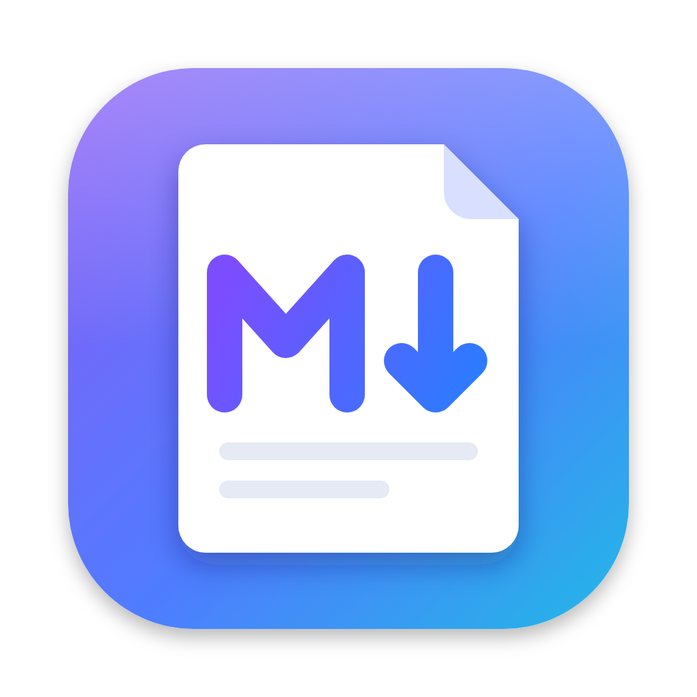

<p align="center"></p>

# MD Viewer

맥용 마크다운 뷰어 겸 에디터. 기본은 뷰어이고, 편집 버튼(⌘E)을 누르면 벨로그처럼 왼쪽 에디터와 오른쪽 미리보기로 나뉜다.

- 수식(KaTeX)과 코드블록(Shiki), mermaid 다이어그램을 [블로그](https://mm-767.github.io)와 같은 방식으로 렌더링
- 툴바: 제목 H1~H4, 굵게, 기울임, 취소선, 인라인 코드, 인용, 링크, 이미지, 코드블록
- 코드블록 버튼을 누르면 언어를 검색해서 고를 수 있다
- 모든 서식에 단축키가 있다. 메뉴바의 서식 메뉴와 도움말 → 키보드 단축키에서 볼 수 있다
- 이미지는 붙여넣기나 드래그로 넣으면 md 안에 base64로 들어간다. 에디터에서는 긴 base64 대신 작은 썸네일과 용량만 보인다
- 에디터 스크롤에 맞춰 미리보기가 따라온다
- 다크모드는 맥 설정을 따른다
- .md 파일로 저장(⌘S)하고 PDF로 내보내기(⌘P)

## 설치

1. [Releases](https://github.com/Mm-767/md-viewer/releases)에서 `MD-Viewer-<버전>-arm64.dmg`를 받는다. Apple Silicon 맥 전용이다.
2. dmg를 열고 `MD Viewer`를 `Applications`로 끌어다 놓는다.
3. 공증받지 않은 앱이라 처음 실행할 때 macOS가 막는다. Finder에서 앱을 우클릭하고 "열기"를 누르면 된다. 그래도 안 열리면 터미널에서 아래를 실행한다.
   ```sh
   xattr -dr com.apple.quarantine "/Applications/MD Viewer.app"
   ```
4. .md를 더블클릭으로 열려면 Finder에서 .md 파일 우클릭 → 정보 가져오기 → 다음으로 열기에서 MD Viewer 선택 → 모두 변경.

## 개발

```sh
npm install
npm start          # 번들 후 앱 실행
npm test           # 렌더링·툴바 명령 테스트
npm run dist       # release/mac-arm64/MD Viewer.app 생성
npm run release    # release/MD-Viewer-<버전>-arm64.dmg 생성
```

아이콘 원본은 `build/icon.svg`이고, 빌드에는 1024px로 렌더링한 `build/icon.png`를 쓴다.
